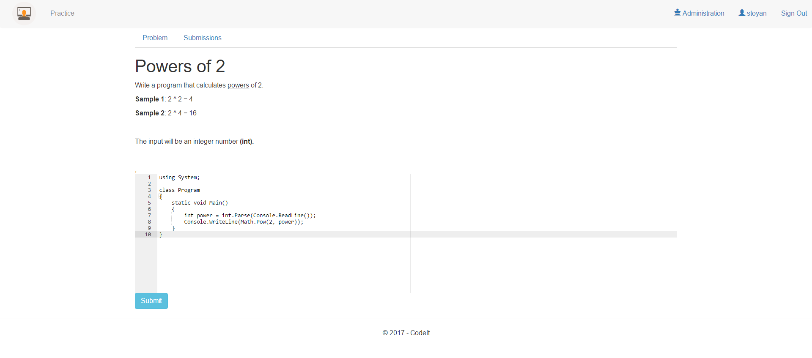

# CodeIt

# Main functionality
- Users can solve programming challenge
- Users can check their results
- Users can select from different categories in different tracks
- Admins can create new challenges
- Admins can repear broken challenge

# Technologies
- ASP.NET MVC
- Razor views
- jQuery
- SQL Server 2016
- Entity Framework 6
- Ninject (DI Container)
- Automapper

# Screenshots

|                                               |                                              |
| -----------------------------------           |:--------------------------------------------:|   
|        |     |
|   | |
| 
